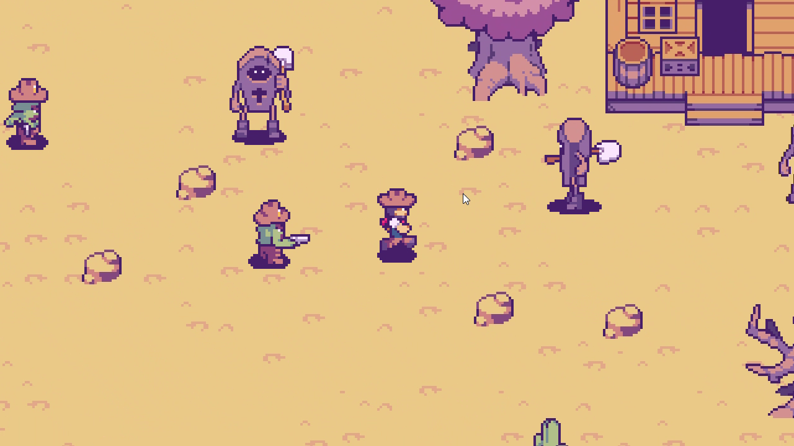
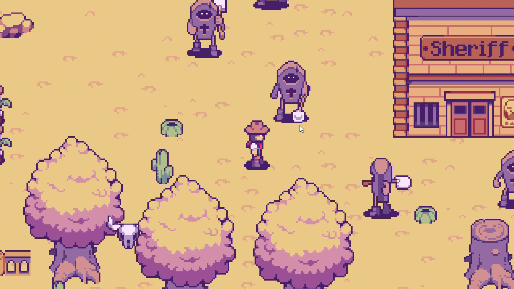

# Western Shooter

Western Shooter is a simple PyGame shooter game where the player gets to fight with lots of monsters! The project was originally written using the pygame library, a Python 2D game development tool as a project of object oriented programming.

## How to help development

You can submit any request you want, or report any bug you encounter by opening an issue.
Feel free to come up with ideas whether it is about coding practices or game mechanics, this project is far from being perfect!

Here are some suggestions of contributions:

- Check the opened issues, there are bugs that could be fixed or enhancement waiting for implementation.
- Help with balancing would be greatly appreciated... I'm not good in this kind of games even if I love them. All values could be found in the XML files wrapped in the data folder.
- Contributions for sound effects or new soundtracks would be really appreciated.

